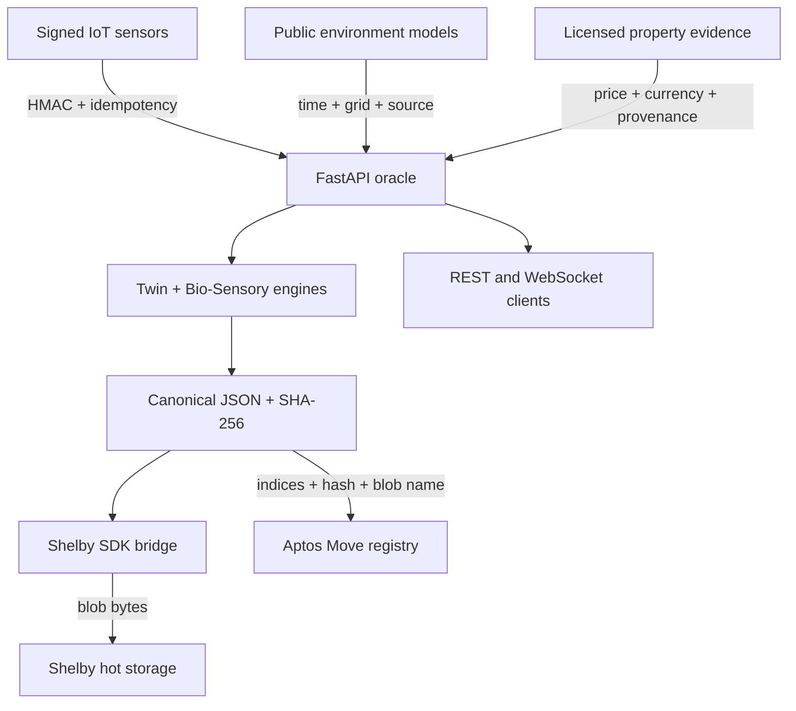

# Architecture and trust boundaries

## Trust model

- Sensors use independent HMAC secrets. Production should enable `REQUIRE_SENSOR_SIGNATURES`.
- The oracle never receives the Shelby account private key. It remains in the internal bridge.
- The oracle and bridge independently verify the canonical JSON SHA-256 digest.
- Environmental responses retain source timestamp, requested coordinates, model-grid coordinates,
  method version, base/effective weights, missing fields, and SHA-256 digest.
- Housing and seasonal-climate evidence must retain provider, observation time, currency/units, and URL.
- Aptos stores digital-twin scores, Bio-Sensory risk, Location Fit, the 32-byte data hash, and the
  Shelby blob name as a compact verification anchor.
- Each asset owner chooses and can rotate the only oracle allowed to update that asset.
- The in-memory latest-snapshot cache is an API convenience, not the source of truth.
- A global ENSO forecast is not treated as a local hazard by itself. A versioned regional or local
  climate-resilience input is required before it affects Location Fit.

For production scale, replace in-process state with Redis/PostgreSQL and submit Aptos updates through
an idempotent transaction worker. The engine and trust-boundary interfaces do not depend on the cache.
