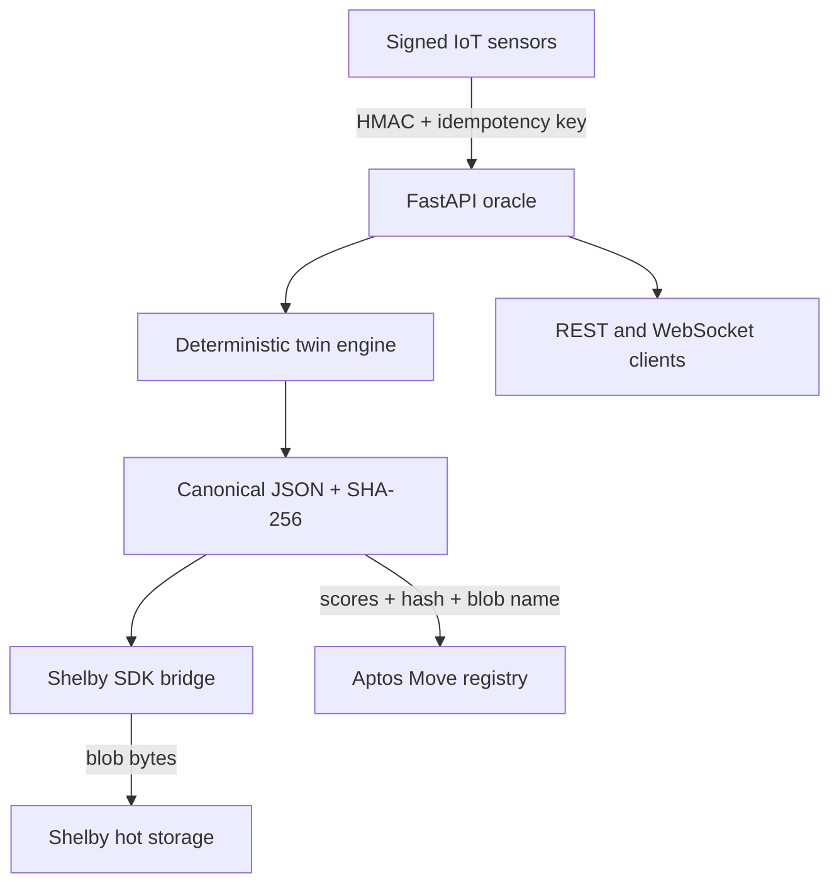

# Architecture and trust boundaries

## Trust model

- Sensors use independent HMAC secrets. Production should enable `REQUIRE_SENSOR_SIGNATURES`.
- The oracle never receives the Shelby account private key. It remains in the internal bridge.
- The oracle and bridge independently verify the canonical JSON SHA-256 digest.
- Aptos stores scores, the 32-byte data hash, and the Shelby blob name as a verification anchor.
- Each asset owner chooses and can rotate the only oracle allowed to update that asset.
- The in-memory latest-snapshot cache is an API convenience, not the source of truth.

For production scale, replace in-process state with Redis/PostgreSQL and submit Aptos updates through
an idempotent transaction worker. The engine and trust-boundary interfaces do not depend on the cache.
